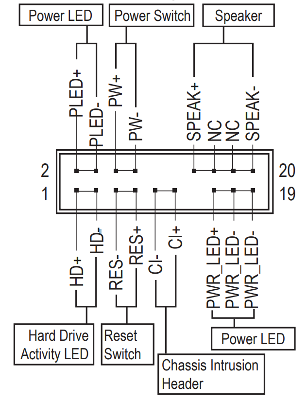
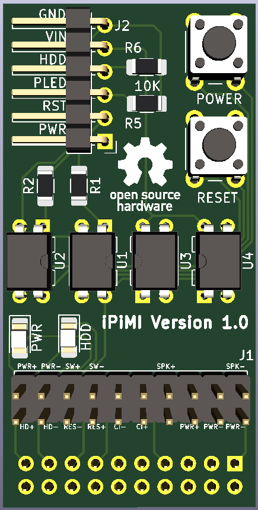

# IPiMI

A simple board to allow you to connect a raspberry pi (or other micro controller) to the front panel connectors on a consumer PC Motherboard.
Totally untested, designed with Gigabyte motherboards in mind. If you use this with another manufacturers board, you may need to modify the front panel connector.

Gigabyte Front Panel Pinout:

# Schematic:

# PCB:

# Render Front:

# Render Back:

